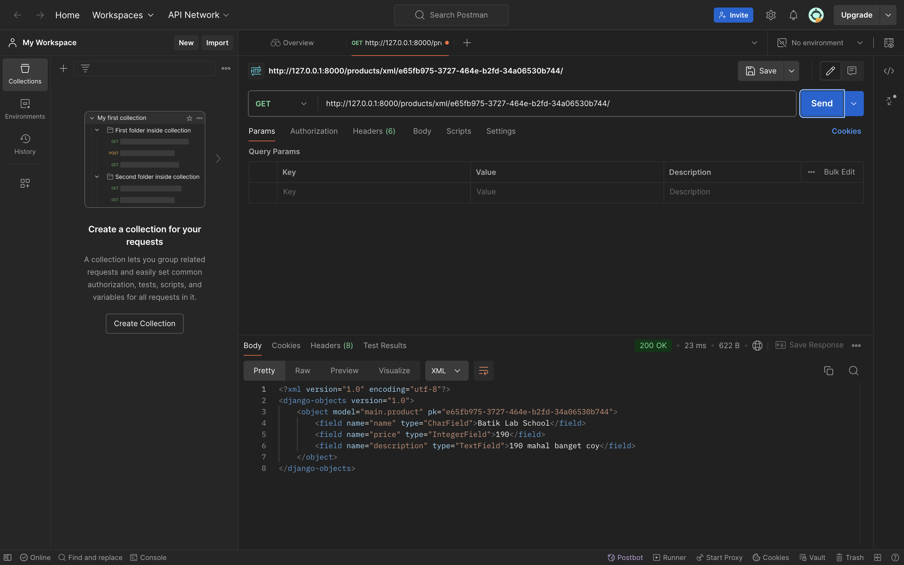

Name: Geordie Vannese Hardjanto

NPM: 2306170414

Class: PBP KKI

# E-Commerce Django Project

## Deployed Application
You can access the application [http://geordie-vannese-georshop.pbp.cs.ui.ac.id/login/].

## Steps Followed
1. Created a new Django project using `django-admin startproject`. ✅
2. Created an app named `main`. ✅
3. Defined URL routing and mapped the home view to the root URL.✅
4. Created a `Product` model with the mandatory attributes.✅
5. Created a view to display the application name, developer's name, and class.✅
6. Designed an HTML template to render the information.✅
7. Deployed the project to PWS for public access. (PWS Is Down Can't Push)

1. Explain How You Implemented the Checklist Step-by-Step (Not Just Following the Tutorial)
Step 1:
Created a new Django project: I used the django-admin startproject ecommerce_project command to initialize a new project. This sets up the base structure of a Django project, including settings, URLs, and other necessary configurations.
Step 2:
Created an app named main: I ran python manage.py startapp main inside the project directory. This app will contain the models, views, and templates specific to the e-commerce application.
Step 3:
Set up routing for the main app: In ecommerce_project/urls.py, I included the URLs from the main app by adding path('', include('main.urls')). I also created a urls.py file inside the main app, where I defined the route to the home view.
Step 4:
Created a Product model: In main/models.py, I created a Product class with three fields: name, price, and description. I used Django’s built-in CharField, IntegerField, and TextField for these fields. After defining the model, I ran python manage.py makemigrations and python manage.py migrate to create and apply the necessary database migrations.
Step 5:
Created a view to render the HTML template: In main/views.py, I created a function called home that renders a template called main/index.html and passes context variables (app_name, your_name, class_name) to the template. This ensures the page displays dynamic data like the app 
name and developer’s name.
Step 6:
Created the HTML template: I created a index.html file inside main/templates/main/. This file contains HTML to display the data from the context passed in the view, such as the name of the application, my name, and the class.

2. Diagram of the Request-Response Flow in a Django Web Application
Client (Browser)  -->  URLs (urls.py)  -->  Views (views.py)  -->  Models (models.py)  -->  Template (HTML) <--     Response (HTML)  <--- 

urls.py: This file maps URLs to views. When a request comes in, Django looks at urls.py to determine which view should handle the request.
views.py: This is where the logic happens. The view retrieves data from the model (if necessary) and sends the data to the template.
models.py: This file defines the structure of the data. The model interacts with the database to fetch, update, or delete data as needed. In this assignment, the Product model defines the structure of items in the e-commerce application.
Template (HTML file): The view passes the data to the template, which is an HTML file. The template renders this data as a webpage that the user can see and interact with.

3. Explain the Use of Git in Software Development
-Git is a version control system that helps developers manage and track changes to their codebase over time. Here are the key uses of Git in software development:
-Version control: Git allows you to create different versions of your code. You can track changes, roll back to previous versions, and compare changes over time.
-Collaboration: Multiple developers can work on the same project simultaneously without overwriting each other's changes. Git facilitates this through branching and merging, allowing developers to work on isolated features and merge them into the main project when ready.
-Backup: Since Git stores your project’s history, it acts as a backup in case anything goes wrong with the current version of your code.
-Branching: You can create branches to work on different features or fixes without affecting the main codebase. Once your work is complete and tested, you can merge the branch back into the main codebase.
-GitHub and other platforms: Git allows you to push your code to remote repositories like GitHub, where it can be shared with collaborators or deployed to production servers.

4. Why is Django Used as the Starting Point for Learning Software Development?
-Ease of Use: Django is designed to help developers build web applications quickly and efficiently. It has a lot of built-in tools that simplify common web development tasks like user authentication, form handling, and database interaction.
-Full-Stack Framework: Django is a full-stack web framework, meaning it provides tools for both frontend (HTML generation) and backend (server-side logic and database interactions) development. This makes it easier for beginners to learn the full development process.
-Batteries-Included: Django follows the "batteries-included" philosophy, meaning it comes with everything you need to build a web application without having to install and configure a lot of external libraries.
-Clear Documentation and Community Support: Django has extensive documentation and a large, active community. This makes it easier for beginners to find help and understand concepts.
-Security Features: Django comes with built-in security features, such as protection against SQL injection, cross-site scripting, and cross-site request forgery. These help beginners build secure web applications without needing to fully understand complex security risks.

5. Why is the Django Model Called an ORM?
-ORM stands for Object-Relational Mapping. In Django, the model is called an ORM because it allows developers to interact with the database using Python objects instead of writing raw SQL queries.
-The Django ORM takes care of translating Python code into SQL queries behind the scenes. For example, when you define a model class like Product, Django automatically generates SQL queries to create tables in the database, insert data, and retrieve records.
-By using an ORM, developers can focus on writing Python code rather than learning SQL, making it easier to manage database interactions. It also makes the application more portable, as the ORM can adapt to different database backends without requiring changes to the code.

# GeorShop - Assignment 3

### Added URLs:
- `/products/json/`: Returns a list of all products in JSON format.
- `/products/json/<uuid:pk>/`: Returns details of a specific product by its ID in JSON format.
- `/products/xml/`: Returns a list of all products in XML format.
- `/products/xml/<uuid:pk>/`: Returns details of a specific product by its ID in XML format.

## Assignment Questions

1. Why do we need data delivery in implementing a platform?
   Data delivery is essential for sharing data between different systems, services, or applications. It enables platforms to provide data to other systems in a structured and accessible format, such as JSON or XML, which can then be consumed by clients or integrated with other platforms.

2. Which is better, XML or JSON? Why is JSON more popular than XML?
   JSON is generally better for web applications due to its simplicity, ease of use, and smaller file size. JSON is more popular than XML because it is easier to parse, more readable, and works more efficiently with JavaScript, which is widely used in modern web development.

3. Explain the functional usage of `is_valid()` method in Django forms.
   The `is_valid()` method is used to validate form data. It checks whether all required fields are filled in correctly and if the input matches the expected format. If validation passes, the form is considered valid, and the data can be saved or processed.

4. Why do we need `csrf_token` when creating a form in Django?
   The `csrf_token` is needed to protect forms from Cross-Site Request Forgery (CSRF) attacks. Without the token, an attacker could trick users into submitting malicious forms. By verifying the `csrf_token`, Django ensures that the form submission originated from the trusted site.

5. Step-by-step Implementation of Checklist:
   - Created a `ProductForm` using Django's ModelForm to allow adding new products.
   - Added views for displaying products in JSON and XML formats, both as a list and by individual ID.
   - Updated `urls.py` to route to the newly created views.
   - Tested all endpoints using Postman to ensure correct functionality.

6.Postman Results:

# GeorShop - Assignment 4
1) What is the difference between HttpResponseRedirect() and redirect()?
-HttpResponseRedirect is a class that returns an HTTP status code 302 with a URL to redirect to.
-redirect is a shortcut function that abstracts the logic and can take a model object, URL, or view name to redirect to.

2)Explain how the MoodEntry model is linked with User!
The MoodEntry model is linked to User through a ForeignKey, meaning each mood entry belongs to a specific user. The user_id field in the MoodEntry table stores the relationship.

3)What is the difference between authentication and authorization, and what happens when a user logs in? Explain how Django implements these two concepts.
Authentication is the process of verifying a user’s identity (login).
Authorization is the process of determining whether a user has permission to access a specific resource.
Django implements authentication through django.contrib.auth and remembers logged-in users using sessions.

4)How does Django remember logged-in users? Explain other uses of cookies and whether all cookies are safe to use.
Django uses session cookies to remember logged-in users. Each session is stored server-side, and the session ID is stored in the user's browser as a cookie.
Cookies are small pieces of data stored on the client’s side and can be used for purposes like tracking users or remembering login states. Not all cookies are safe; sensitive information should be protected.

5) Explain how did you implement the checklist step-by-step (apart from following the tutorial).

-Register:
First, I implemented the user registration feature using Django's UserCreationForm. I created a register view where users can submit their details to create an account. Once the user registers successfully, they are redirected to the login page.
The form was rendered in register.html, and CSRF protection was ensured by including  in the form.

-Login:
I created a custom login_user view where users can log in using their credentials. The view uses Django's authenticate() function to verify the username and password. If the authentication is successful, the login() function is called to log the user in, and the user is redirected to the main page.
After logging in, I set a last_login cookie that stores the timestamp of the last login using response.set_cookie().

-Logout:
The logout functionality was implemented using Django's logout() function. This function logs out the current user and clears the session. After logging out, the user is redirected to the login page.

-Linking Models (Product and User):
I modified the Product model to include a ForeignKey field that links each product to a specific User. This allows products to be owned by individual users, and each user can only see their own products when logged in.
The user field was added to the Product model with on_delete=models.CASCADE to ensure that if a user is deleted, their products are deleted as well.
After modifying the model, I created and applied the migrations using python manage.py makemigrations and python manage.py migrate.

-Displaying User Details and Products:
In the main page view (show_main), I retrieved the logged-in user’s details, such as their username and the last_login cookie value. This data was passed to the template and displayed on the main page.
Additionally, I filtered the products to display only those that belong to the currently logged-in user by using Product.objects.filter(user=request.user).
The main page (main.html) was updated to display the username, last login time, and a list of the user's products.

-Setting Cookies:
I used Django’s cookie system to store the last_login information. After a user logs in, the timestamp of their login is stored in the cookie using response.set_cookie('last_login', <value>). This cookie is then accessed on the main page to display the user's last login time.
The cookie is set when the user logs in and is retrieved in the show_main view to display it in the template.

# Assignment 5: Web Design using CSS, Framework, and Other Features
Questions

# 1. CSS Selectors Priority Order

The priority order of CSS selectors depends on specificity. The general order is as follows:
Inline styles (e.g., style="color: red;") have the highest priority.
IDs (e.g., #example) have higher specificity than classes (e.g., .example).
Classes, attributes (e.g., [type="text"]), and pseudo-classes (e.g., :hover) have the next level of specificity.
Element selectors (e.g., div, p) have the lowest specificity.
If two selectors have the same specificity, the one defined later in the CSS file takes precedence.

# 2. Importance of Responsive Design

Responsive design ensures that a web application works well on a variety of devices, including mobile phones, tablets, and desktop computers. This is important because users expect to access applications from different devices, and a non-responsive design can lead to a poor user experience.

Examples:
Responsive Application: Twitter, where the interface adjusts well on both mobile and desktop.
Non-Responsive Application: An older website that does not scale properly on mobile devices, leading to elements getting cut off or requiring horizontal scrolling.

# 3. Differences between Margin, Border, and Padding
Margin: The space outside an element's border, separating the element from other elements. It is transparent and used for spacing between elements.
Border: The line surrounding the element’s content and padding. It can have different styles, thickness, and colors.
Padding: The space between the content inside an element and the element’s border. It creates space within the element and makes it look less cramped.
Implementation:

margin: 10px;
border: 2px solid black;
padding: 15px;

# 4. Flexbox and Grid Layout Concepts

Flexbox: A layout model that allows items to align and distribute space within a container. It is most useful when you need to arrange elements in a row or column and need them to automatically resize to fit the available space.
Example: display: flex; justify-content: center;
Grid Layout: A layout system for creating complex designs with rows and columns. It allows for explicit control over where elements are placed in a grid and provides greater flexibility than flexbox for two-dimensional layouts.
Example: display: grid; grid-template-columns: repeat(3, 1fr);

# 5. Implementation Checklist Step-by-Step
Delete and Edit Functionality:
1) I added edit and delete buttons to each product card using Django's URL routing to link the buttons to appropriate views for editing and deleting products.
2) CSS Customization:
I used Bootstrap for styling and made custom adjustments with additional CSS for the login, register, and add product pages. I modified button styles, input fields, and form containers for a modern, clean look.
3) Responsive Design for Product List:
I used Bootstrap’s grid system to create a responsive product list that shows product details in cards. Each card is styled with shadows and rounded corners to make the design more appealing.
If no products exist, a centered image with a message is shown, using a conditional  block in Django templates.
4) Responsive Navbar:
I implemented a responsive navbar using Bootstrap’s navbar component. The navbar collapses into a hamburger menu on smaller screens and expands on larger screens, providing a user-friendly experience across all devices.

# Assignment 6
1. Benefits of Using JavaScript in Developing Web Applications
-Interactivity: JavaScript allows for creating highly interactive and dynamic user interfaces. It enables features like sliders, pop-ups, animations, and form validation, which improve user experience.
-Client-Side Processing: JavaScript can handle processing directly on the client side (in the user's browser), which reduces server load and enhances the speed of user interactions, such as form validation before submission.
-Asynchronous Operations: JavaScript supports asynchronous programming through features like Promises, async/await, and fetch(), which allows developers to handle API calls and other asynchronous tasks without blocking the user interface.
-Cross-Platform Compatibility: JavaScript runs in almost all modern web browsers, making it a universal language for web development. With frameworks like React, Angular, or Vue, it can be used for complex single-page applications (SPAs).
Rich Ecosystem: The JavaScript ecosystem includes numerous libraries and frameworks like jQuery, React, Vue, and Angular, which simplify development and provide solutions for a wide range of use cases.

2. Why We Need to Use await When We Call fetch()
-Reason for Using await: The fetch() function returns a Promise, which represents an ongoing process that will resolve (with data) or reject (with an error). Using await allows JavaScript to pause the execution of the function until the fetch() request is complete. This makes the code easier to read and write, and it ensures that the subsequent code only runs once the data is available.
-What Happens If We Don't Use await: If await is not used, the function will not wait for the fetch() request to complete. Instead, it will continue executing the next lines of code immediately. This can lead to issues where you try to access data that hasn't been received yet, causing errors or unexpected behavior.

3. Why Do We Need to Use the csrf_exempt Decorator on the View Used for AJAX POST?
-Cross-Site Request Forgery (CSRF) Protection: Django has built-in CSRF protection to prevent malicious sites from making unauthorized requests to your server on behalf of authenticated users. This is essential for securing forms and APIs.
-csrf_exempt Usage: When you use AJAX to send POST requests, Django expects a CSRF token to be included in the request headers. If this is not done properly, the request will fail due to a CSRF validation error. The csrf_exempt decorator can be used to bypass this check for a specific view, but it's generally recommended to ensure the token is included instead of bypassing the protection.
-Risk of csrf_exempt: Using csrf_exempt can expose your view to CSRF attacks if not managed properly. It's better to configure the front-end to include the CSRF token with each AJAX request using X-CSRFToken headers.

4. Why Can't Input Sanitization Be Done Just in the Front-End? (Continued)
-Server-Side Validation is the Last Line of Defense: The server must assume that all data it receives could potentially be malicious, even if the front-end has been designed to sanitize input. Only server-side validation and sanitization can be trusted to ensure that the data is safe and adheres to the expected format.
-Protection Against XSS and SQL Injection: By sanitizing input on the server side, you protect against Cross-Site Scripting (XSS) attacks, SQL injection, and other malicious inputs. Even if a user bypasses front-end checks, server-side sanitization ensures that the data is properly handled before being saved to the database or rendered back to the client.
-Consistency Across Different Clients: Different users may interact with your application using different browsers or devices. While the front-end validation may differ slightly based on the user’s environment, server-side validation ensures that the rules are uniformly applied to all users, maintaining data integrity and consistency.

5. Step-by-Step Explanation of How the Checklist Was Implemented
Here’s a step-by-step breakdown of how the checklist was implemented for adding a new product entry:

1) Create the View Function for AJAX:
Defined the add_product_entry_ajax function in views.py, which uses @csrf_exempt and @require_POST decorators to handle POST requests. The function processes the form data and saves a new mood entry to the database, responding with a JSON message.

2) Set Up the URL Path:
Added the path to urls.py to route the AJAX requests to the new view:
path('create-ajax/', add_product_entry_ajax, name='add_product_entry_ajax'),

3) Create the HTML Form Inside a Modal:
Added a form inside a Bootstrap modal in main.html to allow users to enter mood details. This form uses AJAX to submit the data without reloading the page.
The form includes fields like product and description, and a submit button triggers the AJAX request.

4) JavaScript for AJAX Submission:
Wrote JavaScript code to handle the form submission using the fetch() API or $.ajax() if using jQuery. The code sends the form data to the create-ajax/ endpoint and processes the server's JSON response.
If the request is successful, the modal is closed, the form is reset, and a new mood card is appended to the list of mood entries without refreshing the entire page.

5) Handle CSRF Tokens in AJAX Requests:
Used $.ajaxSetup to automatically include the CSRF token in the headers of all AJAX requests, ensuring that Django's CSRF protection doesn't block the requests.
This keeps the application secure while still allowing asynchronous form submissions.

6) Update the User Interface Asynchronously:
After successfully creating a new product entry, the JavaScript dynamically updates the DOM with the new mood entry. This is done by appending a new card with the mood details directly to the existing list.
If no product entries existed before, the "No products added yet" message is removed to reflect the new state of the page.

