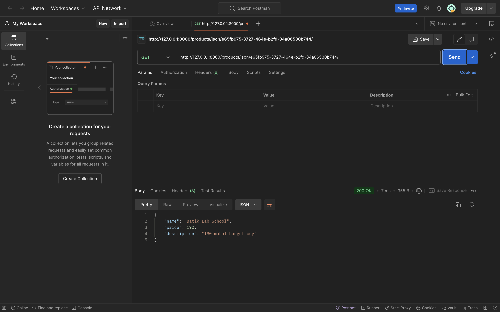

Name: Geordie Vannese Hardjanto

NPM: 2306170414

Class: PBP KKI

# E-Commerce Django Project

## Deployed Application
You can access the application [here](link_to_pws_app)(PWS Is Down Can't Push).

## Steps Followed
1. Created a new Django project using `django-admin startproject`. ✅
2. Created an app named `main`. ✅
3. Defined URL routing and mapped the home view to the root URL.✅
4. Created a `Product` model with the mandatory attributes.✅
5. Created a view to display the application name, developer's name, and class.✅
6. Designed an HTML template to render the information.✅
7. Deployed the project to PWS for public access. (PWS Is Down Can't Push)

1. Explain How You Implemented the Checklist Step-by-Step (Not Just Following the Tutorial)
Step 1:
Created a new Django project: I used the django-admin startproject ecommerce_project command to initialize a new project. This sets up the base structure of a Django project, including settings, URLs, and other necessary configurations.
Step 2:
Created an app named main: I ran python manage.py startapp main inside the project directory. This app will contain the models, views, and templates specific to the e-commerce application.
Step 3:
Set up routing for the main app: In ecommerce_project/urls.py, I included the URLs from the main app by adding path('', include('main.urls')). I also created a urls.py file inside the main app, where I defined the route to the home view.
Step 4:
Created a Product model: In main/models.py, I created a Product class with three fields: name, price, and description. I used Django’s built-in CharField, IntegerField, and TextField for these fields. After defining the model, I ran python manage.py makemigrations and python manage.py migrate to create and apply the necessary database migrations.
Step 5:
Created a view to render the HTML template: In main/views.py, I created a function called home that renders a template called main/index.html and passes context variables (app_name, your_name, class_name) to the template. This ensures the page displays dynamic data like the app 
name and developer’s name.
Step 6:
Created the HTML template: I created a index.html file inside main/templates/main/. This file contains HTML to display the data from the context passed in the view, such as the name of the application, my name, and the class.

2. Diagram of the Request-Response Flow in a Django Web Application
Client (Browser)  -->  URLs (urls.py)  -->  Views (views.py)  -->  Models (models.py)  -->  Template (HTML) <--     Response (HTML)  <--- 

urls.py: This file maps URLs to views. When a request comes in, Django looks at urls.py to determine which view should handle the request.
views.py: This is where the logic happens. The view retrieves data from the model (if necessary) and sends the data to the template.
models.py: This file defines the structure of the data. The model interacts with the database to fetch, update, or delete data as needed. In this assignment, the Product model defines the structure of items in the e-commerce application.
Template (HTML file): The view passes the data to the template, which is an HTML file. The template renders this data as a webpage that the user can see and interact with.

3. Explain the Use of Git in Software Development
-Git is a version control system that helps developers manage and track changes to their codebase over time. Here are the key uses of Git in software development:
-Version control: Git allows you to create different versions of your code. You can track changes, roll back to previous versions, and compare changes over time.
-Collaboration: Multiple developers can work on the same project simultaneously without overwriting each other's changes. Git facilitates this through branching and merging, allowing developers to work on isolated features and merge them into the main project when ready.
-Backup: Since Git stores your project’s history, it acts as a backup in case anything goes wrong with the current version of your code.
-Branching: You can create branches to work on different features or fixes without affecting the main codebase. Once your work is complete and tested, you can merge the branch back into the main codebase.
-GitHub and other platforms: Git allows you to push your code to remote repositories like GitHub, where it can be shared with collaborators or deployed to production servers.

4. Why is Django Used as the Starting Point for Learning Software Development?
-Ease of Use: Django is designed to help developers build web applications quickly and efficiently. It has a lot of built-in tools that simplify common web development tasks like user authentication, form handling, and database interaction.
-Full-Stack Framework: Django is a full-stack web framework, meaning it provides tools for both frontend (HTML generation) and backend (server-side logic and database interactions) development. This makes it easier for beginners to learn the full development process.
-Batteries-Included: Django follows the "batteries-included" philosophy, meaning it comes with everything you need to build a web application without having to install and configure a lot of external libraries.
-Clear Documentation and Community Support: Django has extensive documentation and a large, active community. This makes it easier for beginners to find help and understand concepts.
-Security Features: Django comes with built-in security features, such as protection against SQL injection, cross-site scripting, and cross-site request forgery. These help beginners build secure web applications without needing to fully understand complex security risks.

5. Why is the Django Model Called an ORM?
-ORM stands for Object-Relational Mapping. In Django, the model is called an ORM because it allows developers to interact with the database using Python objects instead of writing raw SQL queries.
-The Django ORM takes care of translating Python code into SQL queries behind the scenes. For example, when you define a model class like Product, Django automatically generates SQL queries to create tables in the database, insert data, and retrieve records.
-By using an ORM, developers can focus on writing Python code rather than learning SQL, making it easier to manage database interactions. It also makes the application more portable, as the ORM can adapt to different database backends without requiring changes to the code.

# GeorShop - Assignment 3

### Added URLs:
- `/products/json/`: Returns a list of all products in JSON format.
- `/products/json/<uuid:pk>/`: Returns details of a specific product by its ID in JSON format.
- `/products/xml/`: Returns a list of all products in XML format.
- `/products/xml/<uuid:pk>/`: Returns details of a specific product by its ID in XML format.

## Assignment Questions

1. Why do we need data delivery in implementing a platform?
   Data delivery is essential for sharing data between different systems, services, or applications. It enables platforms to provide data to other systems in a structured and accessible format, such as JSON or XML, which can then be consumed by clients or integrated with other platforms.

2. Which is better, XML or JSON? Why is JSON more popular than XML?
   JSON is generally better for web applications due to its simplicity, ease of use, and smaller file size. JSON is more popular than XML because it is easier to parse, more readable, and works more efficiently with JavaScript, which is widely used in modern web development.

3. Explain the functional usage of `is_valid()` method in Django forms.
   The `is_valid()` method is used to validate form data. It checks whether all required fields are filled in correctly and if the input matches the expected format. If validation passes, the form is considered valid, and the data can be saved or processed.

4. Why do we need `csrf_token` when creating a form in Django?
   The `csrf_token` is needed to protect forms from Cross-Site Request Forgery (CSRF) attacks. Without the token, an attacker could trick users into submitting malicious forms. By verifying the `csrf_token`, Django ensures that the form submission originated from the trusted site.

5. Step-by-step Implementation of Checklist:
   - Created a `ProductForm` using Django's ModelForm to allow adding new products.
   - Added views for displaying products in JSON and XML formats, both as a list and by individual ID.
   - Updated `urls.py` to route to the newly created views.
   - Tested all endpoints using Postman to ensure correct functionality.

6.Postman Results:

